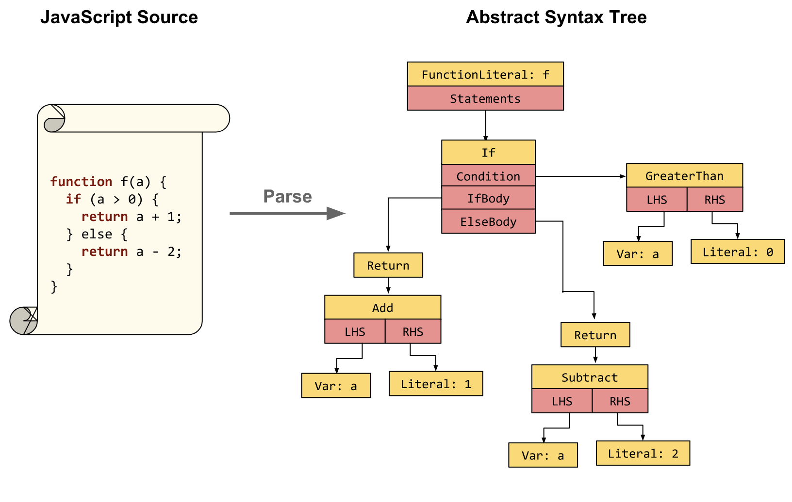
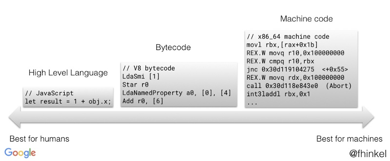
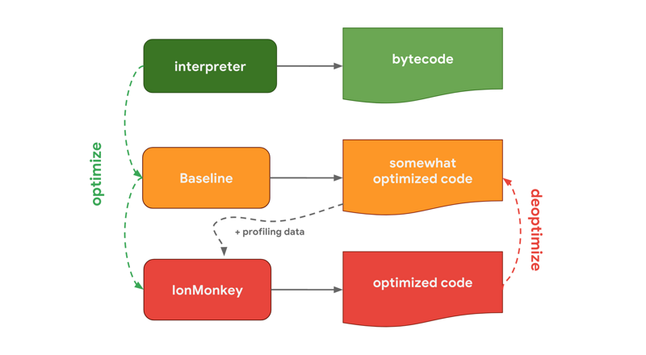

# V8引擎的工作原理


### **什么是V8？**

**V8是Google用C++编写的高性能的JS引擎，这意味着V8是一个C++程序，接收JS代码进行编译执行。**

了解 **V8 引擎**的执行机制，可以帮助我们深入理解JS并且对JS语言有更加充分的认识。

众所周知，程序是通过处理器来运行的。但是处理器不能识别我们所写的代码，只能识别**机器码**，因此需要将代码翻译成机器能读懂的语言，此时就需要**编译器**和**解释器。**

#### 编译型语言与解释型语言

* 编译型：在程序执行之前，需要经过编译器的编译过程，并且保存编译过后的二进制文件，再次执程序时，可以直接运行二进制文件，不需要再次编译。eg：C++、Java、Go
* 解释型：程序每次运行时，需要解释器对程序进行动态解释和执行。eg：JS，Python

### V8 是如何执行一段JS代码的


通过上图，可以看出V8在执行过程中，解释器（Ignition）和编译器（TurboFan）都有参与。在生成 Bytecode 时，会经过一系列的内联优化阶段，提高性能。

### 1. 抽象语法树

由于JS解释器/编译器类似HTML解析器,，需要将js转化成AST后，才能进行解析。通常生成抽象语法树需要两个步骤：词法分析、语法分析。

**第一阶段-词法分析**：将一个个字符串识别出一个个单词就是Token。而且词法分析器是一边读取一边识别，可以通过正则文法和有限自动机打造词法分析器。


如上图所示，描述出标志符、比较操作符、数字字面量这三种Token的词法规则，根据这样的规则来构造有限自动机。

**第二阶段-语法分析：** 根据分词生成的Token，按照语法规则生成AST（抽象语法树）。



上图为函数f解析成AST的结构图，AST可以更方便解释器、编译器理解。可以参考 [https://astexplorer.net/](https://astexplorer.net/)

```text
const a = 1 + 2 * 3;

// add ::= mul ( + mul )*

// EBNF 写法
// non-terminal 非终止符，子集遇到 primary 基础表达式时终止
<non-terminal> ::= <replacement>
```

上述的算术表达式，可使用上下文无关文法来描述。有了AST后，V8会生成该段代码的执行上下文。

### 2. Bytecode 字节码

字节码是介于AST与机器码之间的代码，并且需要解释器将其转化成机器码才能执行。可以通过下图查看高级代码、字节码、机器码之间的内存占比。



从图中可以看出，机器码内存占比远高于字节码，使用字节码可以减少系统内存使用，以时间换空间。

**字节码冲刷**

假如某个函数在最近的一段时间内都没有执行，那么GC在回收时会冲刷掉函数的字节码。为了实现此优化，为函数的字节码增加了老化标记。在垃圾回收期间增加老化数值，在函数执行执行则将老化数值重置为0，任何超过老化阈值的字节码都有可能在下一次垃圾回收时被回收掉。如果字节码被回收后函数继续执行，函数会被重新编译。

### **3. 代码执行**

生成字节码后，进入执行阶段。解释器会逐行解释执行代码，在执行字节码的过程中，如果发现一段代码重复执行多次，这种代码称为HotSpot（热点代码），编译器就会将热点代码的字节码编译为高效执行的机器码。再次执行这段代码时，直接执行编译后的机器码，大大提升了代码的执行效率，这样随着代码的执行时间越长执行效率就越高。



### JS 数据是如何存储的

JavaScript是动态、弱类型的语言：

* 静态类型：变量在使用之前需要确定变量的类型
* 动态类型：在运行的过程中检查数据类型
* 弱类型：支持隐式类型转换的语言，反之强类型则不支持

JS中的数据类型有8种：Boolean、Null、Undefined、String、Symbol、Number、BigInt、Object，其中 typeof null === 'object' 是因为 null 为空指针，它的类型标签为是0， 而Object类型标签就是0。

在JS的执行过程中，主要有三种内存空间：代码空间、栈空间、堆空间。

### 1. 栈空间

栈空间其实就是调用栈，是用来存储执行上下文，并且栈中存储的是基本数据类型与应用类型的地址值。

```text
// 典型栈结构, 函数调用栈

function foo() {
  var a = 1
}
function bar() {
  var b = 2
  foo()
}
bar()

/*
 * bar local frame 
 * 声明变量b
 * ESP 指向下一个指针 foo
 * place for returned value
 */
/*
 * foo local frame 
 * 声明变量a
 * place for returned value
 */
 
  bar执行上下文
| 变量环境  | 词法环境
| b = 2   
|  
  全局执行上下文

```

当bar调用时，对函数内部编译，创建执行上下文。执行时，bar的执行上下文进入栈顶，ESP指向bar指针

1. 此时发现变量b，在执行上下文的变量环境中为变量b分配内存
2. 调用foo，ESP指向foo指针，将 foo 压入栈顶
3. foo 执行完毕后，foo的执行上下文从栈顶弹出，并且foo内部的内存会被回收，bar 返回 undefined

**栈的大小：**当调用栈的大小超出一定限制时，栈会溢出。下面来计算单次调用栈的大小\(执行环境：chrome 78.0.3904.70 浏览器控制台 \)

```text
// 计算单个调用栈指针的大小
var counter = 0
try {
  function foo() {
    counter += 1
    foo()
  }
  foo()
} catch (e) {
  console.log('counter: ', counter)
}
// output counter: 15721


var counter = 0
try {
  function foo() {
    var a = 1  // 1 number = 8 bytes
    counter += 1
    foo()
  }
  foo()
} catch (e) {
  console.log('counter: ', counter)
}
// output counter: 13974

// N 表示单个调用栈指针大小
15721 * N = 13974 * (8 + N) => N ≈ 64 bytes = 8 numbers
总大小: 15721 * 64 = 1006144 < 1MB(1048576)

var counter = 0
try {
  function foo() {
    var a = 1  // 1 number = 8 bytes
    var b = true
    counter += 1
    foo()
  }
  foo()
} catch (e) {
  console.log('counter: ', counter)
}
// output counter: 12577
1006144 / 12577 ≈ 80 = 64 + 8(1) + 8(true)
```

又上述计算可以得出，单个调用栈指针大小为 64 bytes，number类型为8，boolean类型为8

### 2. 堆空间

在上述的 Stack Size 计算过程中，可以添加应用类型，查看引用类型的内存是否对栈有影响。

```text
var counter = 0
try {
  function foo() {
    var c = {}
    counter += 1
    foo()
  }
  foo()
} catch (e) {
  console.log('counter: ', counter)
}
// output counter: 13974
```

通过上述计算，可以看出对象c的地址在栈中占用 1 numbers。


为什么要区分 栈内存、堆内存？

JS需要用栈来维护执行上下文的状态，如果栈空间大了，所有数据都存储在栈中，会影响到执行上下文的切换效率，从而影响整个程序的执行效率。

所以栈空间不会设置太大，主要用来存储基本数据类型。而引用数据类型占用的内存比较大，通常存储在堆空间中。


```text
// 闭包
function foo() {
  var a = 1
  return function c() {
    console.log(a)
  }
}
foo()
```


闭包是怎么形成的？在函数执行完毕后，调用栈被销毁了而闭包仍然存在？

如上述代码所示，引擎执行到foo时，会进行编译，然后创建执行上下文。在编译的过程中，遇到内部函数 c 时，会对c内部进行快速的词法扫描，发现内部函数引用了foo函数中的变量 a，由于内部函数引用了外部函数的变量，引擎会判断这是一个闭包。于是引擎在堆中创建了一个 closure\(foo\) 对象，用来保存变量 a。

在上述代码中，由于内部函数c并有没被调用，所有会被GC掉。



